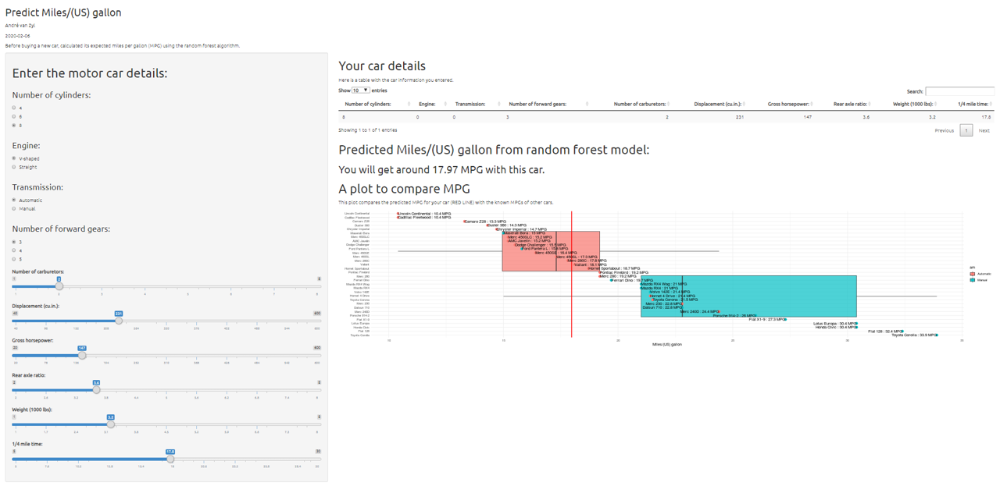

```{r setup, include=FALSE}
knitr::opts_chunk$set(echo = TRUE)
library(tidyverse)
library(DataExplorer)
library(caret)
library(knitr)
library(gridExtra)
```

```{r message=FALSE, warning=FALSE, include=FALSE}
data("mtcars")
mtcars$carname <- rownames(mtcars)
mtcars$vs <- factor(mtcars$vs,levels = c(0,1),labels = c("V-shaped", "Straight")) 
mtcars$am <- factor(mtcars$am,levels = c(0,1),labels = c("Automatic", "Manual")) 
mtcars$cyl <- ordered(mtcars$cyl)
mtcars$gear <- ordered(mtcars$gear)
mtcars$carb <- ordered(mtcars$carb)
```

## The problem

Cars with low miles per gallon are less environmentally friendly and cost their owners a lot of money.     

```{r echo=FALSE, message=FALSE, warning=FALSE}

grid.arrange(
  ggplot(mtcars,
         aes(
           x = reorder(carname, -mpg),
           y = mpg,
           group = am,
           fill = am
         )) +
    geom_boxplot(alpha = .7) +
    geom_point(aes(color = am), size = 3) +
    coord_flip()  +
    theme_minimal() +
    xlab("") +
    ylab("Miles/(US) gallon") +
    facet_grid() + geom_text(aes(
      label = paste(carname, " : " , mpg, " MPG", sep = "")
    ), size = 4, hjust = "inward")
) 
```

## Predict MPG Web App

Luckily, the [Predict MPG Web App](https://andre-van-zyl.shinyapps.io/Shiny_App/) makes it easier to predict the cars’ fuel consumption before you buy it. No need to enter car information into tables like this: 

```{r}
predict_data <- tibble::tribble(
        ~cyl, ~disp,    ~hp, ~drat,   ~wt, ~qsec, ~vs, ~am, ~gear, ~carb,
           8,  230.7, 146.7, 3.597, 3.217, 17.85,  18,   0,     3,     3)
```

Use the convenient user interface: 




## The technology behind the predictions

[ranger: A Fast Implementation of Random Forests](https://rdrr.io/cran/ranger/)

```{r}
data("mtcars");tr_ctrl <- trainControl(method="cv", number=5, verboseIter=FALSE);
rfmodel <- train(mpg~., data=mtcars, method="ranger",trControl = tr_ctrl);rfmodel
```

## What to expect from the app

Capture the car details and get its predicted MPG.

```{r}
rf_predicion <- predict(rfmodel, newdata=predict_data);rf_predicion
```

Compare the predicted MPG with the known fuel consumption of other cars. 

```{r echo=FALSE, message=FALSE, warning=FALSE}
data("mtcars")
mtcars$carname <- rownames(mtcars)
mtcars$vs <- factor(mtcars$vs,levels = c(0,1),labels = c("V-shaped", "Straight")) 
mtcars$am <- factor(mtcars$am,levels = c(0,1),labels = c("Automatic", "Manual")) 
mtcars$cyl <- ordered(mtcars$cyl)
mtcars$gear <- ordered(mtcars$gear)
mtcars$carb <- ordered(mtcars$carb)
grid.arrange(
  ggplot(mtcars,
         aes(
           x = reorder(carname, -mpg),
           y = mpg,
           group = am,
           fill = am
         )) +
    geom_boxplot(alpha = .7) +
    geom_point(aes(color = am), size = 3) +
    coord_flip()  +
    theme_minimal() +
    xlab("") +
    ylab("Miles/(US) gallon") +
    geom_hline(
      yintercept = rf_predicion,
      show.legend = TRUE,
      size = 1,
      color = "red"
    ) +
    facet_grid() + geom_text(aes(
      label = paste(carname, " : " , mpg, " MPG", sep = "")
    ), size = 4, hjust = "inward")
) 
```

